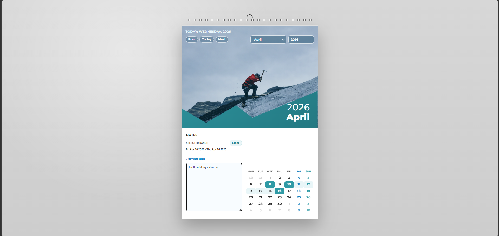

# Wallify Calendar

An interactive React wall-calendar component built for a frontend engineering challenge. The goal was to transform a static visual reference into a polished, responsive, and usable calendar experience with date-range selection and integrated notes.

## Preview



> Tip: replace this with a real full-UI screenshot (for example `./docs/calendar-preview.png`) before final submission.

## Challenge Context

**Frontend Engineering Challenge: Interactive Calendar Component**

This project was implemented to satisfy the following task requirements:

- Recreate a wall calendar aesthetic inspired by a reference image.
- Include a dedicated hero image area that visually anchors the month view.
- Support start/end date range selection with distinct visual states.
- Add an integrated notes section for selected dates/ranges.
- Deliver a fully responsive experience for desktop and mobile.
- Keep scope strictly frontend (no backend/API), favoring client-side persistence.

## What I Built

Wallify Calendar is a single-page React app with:

- A poster-style wall calendar layout with a spiral-bound visual treatment.
- A hero image section with month-based visual theming.
- A 7-column monthly date grid with range interactions.
- A notes panel tied to the current selected date or date range.
- Month navigation controls (`Prev`, `Today`, `Next`) plus month/year pickers.
- Local persistence for notes using `localStorage`.

## Core Features

### 1) Wall Calendar Aesthetic
- Top hero image panel with tinted overlay and diagonal month banner.
- Physical poster details (binding holes, paper/card depth, visual hierarchy).
- Month-specific color accents applied across selected dates and notes UI.

### 2) Day Range Selector
- Click once to set a start date.
- Click again to set the end date.
- If second click is before start, the range auto-normalizes.
- Visual states include:
	- range start
	- range end
	- in-between days
	- today highlight

### 3) Integrated Notes
- Notes editor is enabled when a day/range is selected.
- Notes are saved per month and per selected range key.
- Clear action removes the current range note and resets selection.

### 4) Responsive Behavior
- Works across desktop and mobile viewport widths.
- Maintains usability of date cells, controls, and notes area on touch screens.
- Compact typography and spacing adjustments are applied on smaller screens.

## Tech Stack

- React (Vite)
- JavaScript (ES modules)
- CSS (custom styling)
- Browser `localStorage` for persistence

## Project Structure

```text
Wallify-Calendar/
	README.md
	calendar-app/
		package.json
		index.html
		src/
			App.jsx
			App.css
			components/
				Calender.jsx
				CalenderGrid.jsx
				DayCell.jsx
				HeroImage.jsx
				NotesPanel.jsx
				calendarConfig.js
```

## Run Locally

From the app folder:

```bash
cd calendar-app
npm install
npm run dev
```

## Available Scripts

Inside `calendar-app`:

- `npm run dev` - Start development server
- `npm run build` - Create production build
- `npm run preview` - Preview production build locally
- `npm run lint` - Run ESLint

## Architecture Notes

- `Calender.jsx` is the main state container:
	- month/year view state
	- selected range state
	- note persistence and retrieval
- `CalenderGrid.jsx` generates a 6-row monthly matrix including overflow days.
- `DayCell.jsx` handles per-day visual state composition.
- `HeroImage.jsx` renders navigation and month branding.
- `NotesPanel.jsx` manages range context + note input UX.
- `calendarConfig.js` maps months to hero images and palette themes.

## Key Idea
A frontend-only calendar system focused on UI precision, interaction design, and usability—no backend used.

